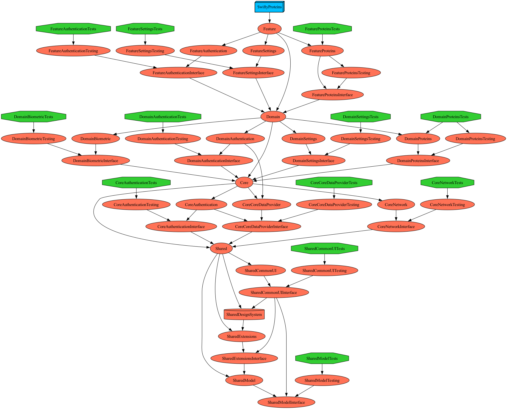

# swifty-proteins *Apply a modular architecture 

**English** | [한국어](README.ko.md)

The app is split into five layers: App - Features - Services - Core - Shared (UserInterface).

</br>

# Getting Started

### Requirements

- Xcode 26 or later
- [Tuist](https://tuist.dev) 4.x (pinned to 4.201.0 in `.mise.toml`)

### Build and run

```bash
git clone https://github.com/chanheki/swifty-proteins.git
cd swifty-proteins
mise trust   # only if you use mise; makes it use the pinned Tuist version
make         # installs packages and generates the Xcode project
open SwiftyProteins.xcworkspace
```

In Xcode, pick the `SwiftyProteins` scheme and a simulator, then run (⌘R).

### Signing in

- **Sign in as Guest**: use every feature right away without an account (Firebase anonymous sign-in).
- **Sign in with Google / Apple**: works with the Firebase config included in the repository.

After signing in, register an app password to reach the ligand list and the 3D view.

### Running on a device

`DEVELOPMENT_TEAM` in `Configs/Debug.xcconfig` is set to the repository owner's team. To install on a device, change it to your own team ID, and change the bundle ID (`kr.mois.SwiftyProteins`) if needed. A different bundle ID no longer matches the Firebase config, so Google sign-in will not work. The simulator needs no signing and runs as is.

</br>

# What each layer does

### App

- App entry point and overall app lifecycle
- Main app configuration and initialization

### Feature

- User interface and handling of user actions
- Views and view-related logic

### Domain

- Business logic and the app's domain models
- Entities, use cases, repository interfaces, etc.

### Core

- Pure functional modules with no app business logic
- Networking, database, biometrics, etc.

### Shared

- Code used across many modules
- Styles, resources, extensions, etc.
- Common views, the design system, and other UI elements

</br>

# Target Type

Each module has these target types:

- Interface: the interface
- Implement: the implementation
- Tests: tests
- Testing: mocks for tests

</br>

### Tuist Dependency Graph



</br>

</br>

# Implementing each feature

### Authentication - OAuth sign-in (implemented with Firebase)

- Core: NetworkingModule (OAuth networking code), FirebaseModule (Firebase authentication)
- Domain: AuthDomain (authentication business logic and interfaces)
- Feature: AuthFeature (sign-in UI and related screens)

### On app launch - biometric authentication (Touch ID, Face ID, etc.)

- Core: BiometricModule (biometric authentication utilities)
- Feature: AuthFeature (biometric authentication UI and screens)

### Error handling - API errors and unauthorized screens

- Core: ErrorHandlingModule (common error utilities and network error handling)
- Shared: ErrorView (error message UI and error screens)

### Running the app

- Protein list view: tableView → ligands list
  - Feature: FeatureProteins (Protein List View - TableView)

- Protein view: SceneKit → shows the data received from the model
  - Core: NetworkingModule (API communication)
  - Feature: FeatureProteins (Protein View - 3D model with SceneKit)

- Protein model → defines the model received from the API
  - Domain: DomainProteins (Protein Model and data structures)

- Protein viewmodel → business logic for the model received from the API
  - Domain: DomainProteins (ViewModel business logic)

</br>

### Object-oriented design

1. Separated modules: each layer and module is clearly separated. When a feature is needed, it is accessed through that layer's interface.
2. Reusability: common code and utilities live in the Shared and Core layers to maximize reuse.
3. Dependency injection: dependencies between layers are passed in wherever possible to keep coupling low.
4. Testability: the Domain layer's business logic, and each layer's logic, is designed to be testable so unit tests are easy to write.
5. Separating UI and logic: UI and business logic in the Feature layer are clearly separated for readability and maintainability.

</br>

### Test code example

Part of the actual code written to test the Domain layer's business logic.

``` swift
//  ProteinsTesting.swift

import DomainProteinsInterface

public final class MockPDBDataProvider: ProteinsPDBDataProvider {
    public init() {}
    
    public func getPDBData(name: TestingNameEnum) -> String {
        switch name {
        case .pdbMock001:
            return self.pdbMock001
        case .pdbMock002:
            return self.pdbMock002
        }
    }
    
    public let pdbMock001 = 
"""
ATOM      1  C01 001 A   1       0.484  -0.006  -3.053  1.00 10.00           C
ATOM      2  C02 001 A   1       0.579   1.363  -3.213  1.00 10.00           C
...
CONECT   87   45
END
"""

    public let pdbMock002 = 
"""
ATOM      1  C1  002 A   1      -1.036   0.293   0.447  1.00 10.00           C
ATOM      2  C2  002 A   1      -1.041   1.804   0.685  1.00 10.00           C
...
CONECT   67   32
END
"""
}

//  ProteinsUITest.swift
final class LigandViewModelTests: XCTestCase {
    private var viewModel: LigandViewModel!
    private var cancellables: Set<AnyCancellable>!
    private var mockPDBDataProvider: MockPDBDataProvider!
    
    func testFetchLigandDataAndCompareWithMockData() {
        let mockPDBData = mockPDBDataProvider.getPDBData(name: .pdbMock001).data(using: .utf8)!
        let expectation = XCTestExpectation(description: "Fetch ligand data and match with mock data")
        var fetchedData: Data?
        
        self.viewModel.$ligandData
            .dropFirst()
            .sink { data in
                fetchedData = data
                XCTAssertNotNil(data, "Ligand data should not be nil")
                expectation.fulfill()
            }
            .store(in: &cancellables)
        
        self.viewModel.fetchLigandData(for: "001")
        
        wait(for: [expectation], timeout: 5.0)
        
        print("Fetched Data Dump")
        dump(fetchedData)
        print("Mock Data Dump")
        dump(mockPDBData)
        
        XCTAssertEqual(fetchedData, mockPDBData, "Fetched data should match the mock data")
    }
}

```

### Demo

https://github.com/user-attachments/assets/243b039d-64e3-4523-a881-31236cd9f032


https://github.com/user-attachments/assets/6ea35773-c9c1-4fa3-8fee-e3d3890be0e6
