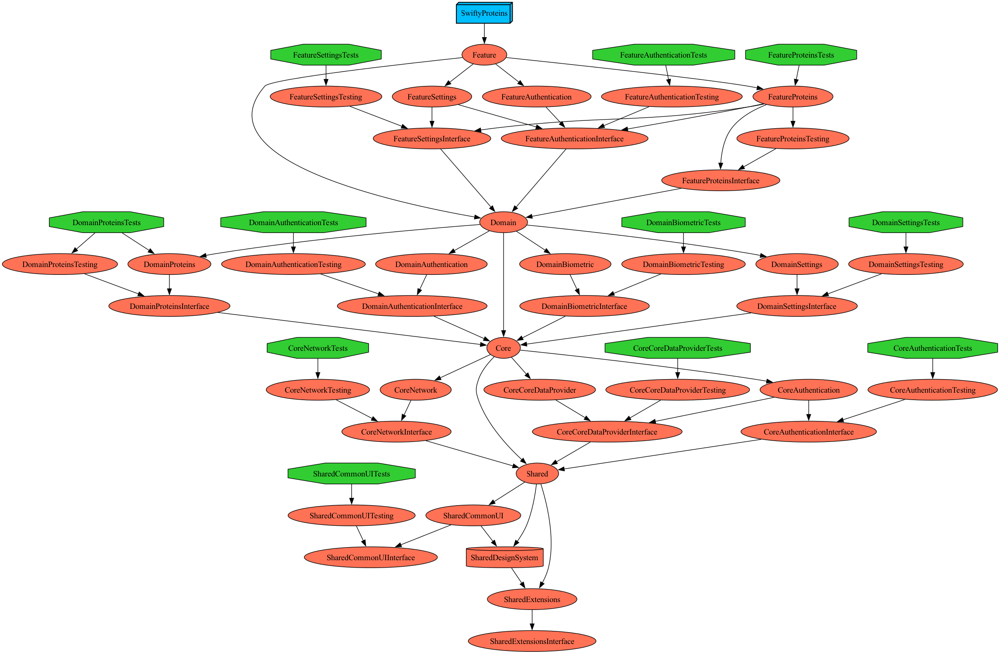

# swifty-proteins *Apply a modular architecture 

App - Features - Services - Core - Shared(UserInterface) 5개의 레이어를 가집니다.

</br>

# What each layer does (각 기능의 역할)

### App

- 앱의 진입점 및 전체적인 앱 라이프사이클 관리
- 주요 앱 설정 및 초기화 코드

### Feature

- 사용자 인터페이스 및 사용자의 액션을 처리
- 뷰(View) 및 뷰와 관련된 로직

### Domain

- 비즈니스 로직과 애플리케이션의 도메인 모델
- 엔터티, 유스케이스, 리포지토리 인터페이스 등

### Core

- 앱의 비즈니스를 포함하지 않는 순수 기능성 모듈
- 네트워킹, 데이터베이스, 바이오메트릭스 등

### Shared

- 여러 모듈에서 공통적으로 사용되는 코드
- 스타일, 리소스, 확장 기능 등
- 공용 뷰, 디자인 시스템, 리소스 등 UI 요소

</br>

# Target Type

타겟 타입은 다음과 같습니다.

- Interface: 인터페이스
- Implement: 구현부
- Tests: 테스트
- Testing: 테스트를 위한 목업

</br>

### Tuist Dependency Graph



</br>

</br>

# Implementing each feature (각 기능 구현)

### 인증 부분 - OAuth 사용, 로그인 (Firebase로 구현)

- Core: NetworkingModule (OAuth 네트워크 관련 코드), FirebaseModule (Firebase 인증 관리 코드)
- Domain: AuthDomain (인증 관련 비즈니스 로직 및 인터페이스)
- Feature: AuthFeature (로그인 UI 및 로그인 관련 화면)

### 앱 실행 시 - 바이오메트리 인증 (TouchID, FaceID 등)

- Core: BiometricModule (바이오메트리 인증 관련 유틸리티 및 네트워크 코드)
- Feature: AuthFeature (바이오메트리 인증 UI 및 화면)

### 에러처리 - API 에러처리 및 미 인가 화면

- Core: ErrorHandlingModule (공통 에러 처리 유틸리티 및 네트워크 에러 핸들링)
- Shared: ErrorView (에러 메시지 UI 및 에러 화면)

### 앱 구동

- Protein list view: tableView → ligands list
  - Feature: FeatureProteins (Protein List View - TableView 구현)

- Protein view: SceneKit → model로 부터 받은 데이터를 보여주는곳
  - Core: NetworkingModule (API 통신 관련 코드)
  - Feature: FeatureProteins (Protein View - SceneKit을 사용한 3D 모델 표시)

- Protein model → API로부터 받을 모델을 정의하는곳
  - Domain: DomainProteins (Protein Model 정의 및 데이터 구조)

- Protein viewmodel → API로 받은 모델의 비즈니스로직
  - Domain: DomainProteins (ViewModel과 관련된 비즈니스 로직)

</br>

### 객체지향적 설계

1. 분리된 모듈: 각 레이어와 모듈을 명확히 분리합니다. 특정 기능이 필요한 경우 해당 레이어의 인터페이스를 통해 접근하도록 설계합니다.
2. 재사용성: 공통 코드와 유틸리티는 Shared 및 Core 레이어에 위치시켜 재사용성을 극대화합니다.
3. 의존성 주입: 각 레이어 간의 의존성은 가능한 한 주입 방식을 통해 관리하여 결합도를 낮춥니다.
4. 테스트 가능성: Domain 레이어의 비즈니스 로직, 각 레이어의 로직은 테스트 가능하도록 설계하여 단위 테스트를 용이하게 합니다.
5. UI와 로직 분리: Feature 레이어의 UI와 비즈니스 로직은 명확히 분리하여 코드의 가독성과 유지보수성을 높입니다.

</br>

### 테스트 코드 예시

Domain 레이어의 비즈니스 로직을 테스트 하기 위해 작성된 실제 코드의 일부를 가져왔습니다.

``` swift
//  ProteinsTesting.swift

import DomainProteinsInterface

public final class MockPDBDataProvider: ProteinsPDBDataProvider {
    public init() {}
    
    public func getPDBData(name: TestingNameEnum) -> String {
        switch name {
        case .pdbMock001:
            return self.pdbMock001
        case .pdbMock002:
            return self.pdbMock002
        }
    }
    
    public let pdbMock001 = 
"""
ATOM      1  C01 001 A   1       0.484  -0.006  -3.053  1.00 10.00           C
ATOM      2  C02 001 A   1       0.579   1.363  -3.213  1.00 10.00           C
...
CONECT   87   45
END
"""

    public let pdbMock002 = 
"""
ATOM      1  C1  002 A   1      -1.036   0.293   0.447  1.00 10.00           C
ATOM      2  C2  002 A   1      -1.041   1.804   0.685  1.00 10.00           C
...
CONECT   67   32
END
"""
}

//  ProteinsUITest.swift
final class LigandViewModelTests: XCTestCase {
    private var viewModel: LigandViewModel!
    private var cancellables: Set<AnyCancellable>!
    private var mockPDBDataProvider: MockPDBDataProvider!
    
    func testFetchLigandDataAndCompareWithMockData() {
        let mockPDBData = mockPDBDataProvider.getPDBData(name: .pdbMock001).data(using: .utf8)!
        let expectation = XCTestExpectation(description: "Fetch ligand data and match with mock data")
        var fetchedData: Data?
        
        self.viewModel.$ligandData
            .dropFirst()
            .sink { data in
                fetchedData = data
                XCTAssertNotNil(data, "Ligand data should not be nil")
                expectation.fulfill()
            }
            .store(in: &cancellables)
        
        self.viewModel.fetchLigandData(for: "001")
        
        wait(for: [expectation], timeout: 5.0)
        
        print("Fetched Data Dump")
        dump(fetchedData)
        print("Mock Data Dump")
        dump(mockPDBData)
        
        XCTAssertEqual(fetchedData, mockPDBData, "Fetched data should match the mock data")
    }
}

```

### 구동화면


https://github.com/user-attachments/assets/0df945c3-2ca1-4128-b483-41bed8a37bc0


https://github.com/user-attachments/assets/c50762c7-ee3e-41e4-815f-aee1afb1761e

